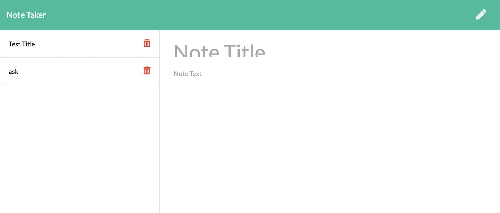

# Express.js-Note-Taker


  


  
  
  
  
  
  
  
  # Description
  📝 This is an application that can be used to write, save, and delete notes. This application will use an express backend and save and retrieve note data from a JSON file.
 

  # Table of Contents
  - [Description](#description)
  - [Usage](#usage)
  - [Installation](#installation)
  - [Links](#links)

 # User Story
```
AS A user, I want to be able to write and save notes
I WANT to be able to delete notes I've written before
SO THAT I can organize my thoughts and keep track of tasks I need to complete
```
# Business Context

For users that need to keep track of a lot of information, it's easy to forget or be unable to recall something important. Being able to take persistent notes allows users to have written information available when needed.

# Acceptance Criteria
```
Application should allow users to create and save notes.
Application should allow users to view previously saved notes.
Application should allow users to delete previously saved notes.
```



# Installation
🗳 <code>Node.js</code>,<code>npm install inquirer</code>,<code>npm install express</code>,<code> Heroku</code>

# Usage
💻 Open [Heroku](https://express-js-note-taker.herokuapp.com/) link, click "Get Started," enter the titled, enter text under the title, and then click save button at the top-tight corner of the page. If you want to delete the text, click trash can icon on the left. 

 
  
# Links
:atom_symbol: [Heroku](https://express-js-note-taker.herokuapp.com/)<br />
:octocat: Github [repo](https://github.com/jmorris107/Express.js-Note-Taker.github.io) <br />/Account: [jmorris107](https://github.com/)<br />
<br />
  
